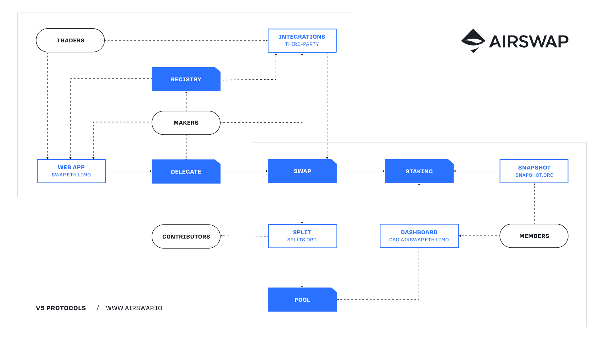

# Welcome

   

[AirSwap](https://www.airswap.xyz) is an open developer community focused on decentralized trading systems. AirSwap technology powers peer-to-peer networks using de facto standard [RFQ](./technology/protocols.md) and [LastLook](./technology/protocols.md) protocols making it the top choice for traditional market makers entering the decentralized financial system.

**Our vision** is a future where all forms of value are represented as digital assets and flow freely and reliably among people and communities around the world. **Our mission** is to become the standard peer-to-peer trading system: a fundamental primitive of the decentralized economy.

At its core, AirSwap enables two parties to perform an "atomic swap" transaction, through which both sides succeed or the entire transaction reverts. These transactions are "trustless" in a way that neither party needs to trust one another to complete the swap.

- **Not your keys, not your coins**. AirSwap is non-custodial and without deposits or escrow. Every transaction is peer-to-peer with no counterparty risk, no intermediating participants, and no infrastructure beyond an EVM.
- **Competitive and efficient**. Trading firms provide liquidity via AirSwap at competitive prices by hedging on centralized exchanges. Since it’s peer-to-peer, the price you see is the price you get, without slippage, front running, or manipulation.
- **Zero limitations**. Each swap is between two parties, two tokens, and a smart contract. This means any standardized digital token implements its own transfer restrictions and can be swapped at any price or size.

## Technology

AirSwap curates a peer-to-peer network for trading digital assets: a novel design that protects traders from counterparty risk, price slippage, and front running. Any market participant can discover others and trade directly peer-to-peer using a combination of web protocols and smart contracts. AirSwap technology is open source and all code can be found on [GitHub](https://github.com/airswap/).

### Architecture

AirSwap is developed and governed by an open-source community and DAO. The network is comprised of trading protocols and applications that generate protocol fees. These are routed through the swap contracts to other smart-contract based systems that support contributor tips and rewards for those actively participating in the DAO. On the following diagram, blue entities are core contracts, blue-outlined entities are applications, and black-outlined entities are participants.

### Applications

Several end-user applications are available.

- [AirSwap DEX](https://dex.airswap.xyz/) — All things peer-to-peer swaps.
- [AirSwap DAO](https://dao.airswap.xyz/) — Dashboard for community members.
- [AirSwap CLI](https://github.com/airswap/airswap-cli) — Command-line interface to interact with the network.

Several DEX aggregators and market makers implement AirSwap.

- [MetaMask Swaps](https://metamask.io/swaps.html) — Swap directly from the MetaMask wallet browser extension.

Several third-party applications serve important roles.

- [Snapshot](https://snapshot.box/#/s:vote.airswap.eth) — Proposal voting by token holders.
- [Splits](https://app.splits.org/accounts/0xaD30f7EEBD9Bd5150a256F47DA41d4403033CdF0/?chainId=1) — Protocol fee routing.

### Protocols

At the protocol level, each swap is between two parties, a signer and a sender. The signer is the party that creates and cryptographically signs an order, and sender is the party that sends the order to an EVM for settlement.

- **[Request-for-quote](./glossary.md#request-for-quote-rfq)** (RFQ) is an automated request-response protocol for market makers running web servers from which clients request orders via JSON-RPC or WebSocket. Maker servers respond to client requests with signed orders, which are assessed by the client who then has the option to complete the swap on-chain. For example, [MetaMask Swaps](https://medium.com/metamask/introducing-metamask-swaps-84318c643785) implements AirSwap RFQ to enable users to swap tokens directly from within their MetaMask wallet by requesting orders directly from market makers.

- **[LastLook](./glossary.md#last-look-ll)** (LL) is an automated streaming protocol via JSON-RPC over WebSocket. With LastLook, market makers continuously stream asset prices to clients in real-time. Clients can then sign and transmit orders based on the prices they receive to the maker, who then has the "last look" and the option to complete the swap on-chain. LastLook also has the added benefit of being effectively gasless for the client. For example, when a quote on [swap.eth.limo](http://swap.eth.limo) displays the "gasless" label, your web browser is connected directly to a market maker using the LastLook streaming protocol.

- **[Over-the-counter](./glossary.md#over-the-counter-otc)** (OTC) is manual trading between known counterparties, with prices communicated via chat applications or email and using AirSwap for settlement. Some of the [largest trades](https://etherscan.io/tx/0x346a9f45c70d4f323c67fd0f348b2a8aaa7477a719557c27a8130c8873279d3b) in DeFi have been made on AirSwap OTC. For example, Stake DAO, a digital asset management firm, uses AirSwap OTC for an ETH put selling investment strategy.

### Analytics

See the [AirSwap Analytics](https://analytics.airswap.xyz/) dashboard for latest trading network and community stats.

## Community

AirSwap is a community asset held by its token holders, operating as an open project with a transparent decision-making and product development process. Both the network technology and contributor community aim to be maximally decentralized. Community members stake AirSwap tokens (AST) to participate in governance and other community benefits. Ideating, drafting, voting on, and accepting proposals is an open process.

### Values

- **Quality** — We craft software systems that are thoughtful, elegant, and secure. We envision and create the best form of each protocol and product that we deliver.
- **Transparency** — Decisions are made in the open and contributions are open source. New information is continuously and actively shared throughout.
- **Inclusion** — All contribution opportunities are accessible and inclusive. Every community member is treated fairly and consistently.
- **Automation** — We strive to run organizational processes and execute relevant tasks entirely automatically using trustless and transparent tools.

### Token

AirSwap launched with the AirSwap Token (AST) [October 10th, 2017](https://medium.com/fluidity/airswap-token-launch-report-fbd04b748eb1) on the original peer-to-peer swap network. The token initially enabled traders to announce their availability and today also functions as a way for contributors to participate in governance and development. AST gives its holders the opportunity to work commensurate with their holdings, and the opportunity to earn commensurate with their contribution, which fundamentally requires active participation. AST is the gateway to joining and contributing to the AirSwap community.

### Governance

To generate new ideas and directions for the project and cultivate transparency, we use a process called [AirSwap Improvement Proposals (AIP)](./community/proposals.md). AIPs give the community a way to vote on and finalize proposals on an ongoing basis. For more information see [AIP 1](https://github.com/airswap/airswap-aips/issues/1) and check out [all active proposals](https://github.com/airswap/aips). This is how the community captures, selects, and prioritizes new projects.

Each AIP is ratified by calling it to vote and being accepted by the token holder community. Voting is held on [Snapshot](https://snapshot.org/#/vote.airswap.eth). Once votes are completed, proposals are considered finalized and placed in a backlog for selection by contributors. Based on requirements and feasibility, contributors may accept the proposal for prioritization and implementation.

## History

AirSwap [launched on October 10th, 2017](https://medium.com/fluidity/airswap-token-launch-report-fbd04b748eb1). Over the years, new products and upgrades have been continuously published to further enable and popularize the benefits of trading digital assets using decentralized protocols. See the years in review for [2018](https://medium.com/fluidity/2018-a-year-in-review-d7f5cb0e5d76), [2019](https://medium.com/fluidity/2019-a-year-in-review-6b40035e6edb), [2021](https://medium.com/airswap/2021-a-year-in-review-20dff123b11), [2022](https://medium.com/airswap/2022-a-year-in-review-918f1d7b9a71), [2023](https://medium.com/airswap/2023-a-year-in-review-7bebc102c0d7), and [2024](https://medium.com/airswap/2024-a-year-in-review-545c02635734).

- [AirSwap Roadmap](https://medium.com/fluidity/the-airswap-roadmap-1c1a3c3b20d3) (November 16th, 2017)
- [AirSwap is Here](https://medium.com/fluidity/airswap-is-here-c83c001d5bbe) (April 25, 2018)
- [Spaces is Here](https://medium.com/fluidity/spaces-is-here-a36fa6753474) (October 10, 2018)
- [AirSwap Instant 2.0](https://medium.com/fluidity/airswap-instant-2-0-d10906447838) (April 26, 2019)
- [AirSwap Trader](https://medium.com/fluidity/introducing-airswap-trader-63a0ef9e67c0) (August 6, 2019)
- [AirSwap Delegates](https://medium.com/fluidity/introducing-airswap-delegates-1c3db83be1db) (February 4, 2020)
- [Phase II Kickoff](https://x.com/airswap/status/1346542008345747457) and [Transition Complete](https://x.com/airswap/status/1359190898110853122) (2021)
- [AirSwap Web App](https://medium.com/airswap/airswap-dao-launches-new-app-cb5a9735b9e1) (2021)
- [AirSwap V3](https://medium.com/airswap/introducing-airswap-v3-97f8d14bebad) (2022)
- [AirSwap V4](https://medium.com/airswap/introducing-airswap-v4-1962923ccc74) (2023)
- [AirSwap NFT and OTC 2.0](https://medium.com/airswap/happy-10-10-nft-marketplaces-otc-2-0-protocols-4-1-and-more-b49cf6b1bc2f) (2023)
- [AirSwap V5](https://x.com/airswap/status/1844478269225304095) (2024)

Having achieved its initial goals and delivered its technology roadmap, AirSwap is now an open project and community of contributors who pursue initiatives to continue to develop and grow the network.

- **AirSwap** is recognized by...
  - **St. Louis Fed** as the leading peer-to-peer trading protocol [→](https://research.stlouisfed.org/publications/review/2021/02/05/decentralized-finance-on-blockchain-and-smart-contract-based-financial-markets)
  - **MIT Technology Review** as a protocol built to survive [→](https://www.technologyreview.com/2018/02/22/145100/when-the-cryptocurrency-bubble-pops-these-tokens-are-built-to-survive/)
  - **Stanford Journal** on Blockchain Law and Policy [→](https://stanford-jblp.pubpub.org/pub/deconstructing-dex/release/1)
  - _**Trust Machine**_, a 2018 film about the blockchain industry [→](https://www.imdb.com/title/tt7407496/)
- Used for the **first ever peer-to-peer swap** of a tokenized security [→](https://tokenist.com/airswap-facilitates-first-compliant-security-token-transfer-on-a-public-blockchain/)
- **Rated #1 in security** among decentralized exchanges (DEX) [→](https://icorating.com/pdf/65/1/pnN3XH96SRWtSs1YMNn2MSw805II3mD7UwKyMrPA.pdf)
- Founding member of **"wrapped bitcoin" (WBTC)** to represent bitcoin on Ethereum [→](https://www.bitgo.com/newsroom/press-releases/wbtc-brings-bitcoin-to-ethereum)
- Active in the **Ethereum community** and a champion of the technology [→](https://medium.com/fluidity/airswap-devcon-5-43adcf758ba8)

## Explore

- AirSwap [Discord Server](https://discord.gg/Pc6gV3hFjR)
- AirSwap [Member Dashboard](https://dao.airswap.eth.limo/)
- AirSwap [Twitter](https://x.com/airswap)
