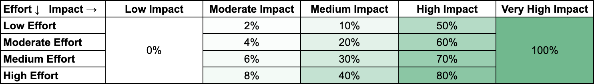

# Bounties

**Bounties** work in combination with the AIP system. AIPs are for new strategic directions and project proposals with budgets, teams, and timelines. Bounties are open and collaborative areas of interest and specific smaller tasks. Each bounty is an invitation to create something helpful and productive for the AirSwap community and network.

## Categories

You are welcome to submit bounties for any of the following categories.

### Awareness and Education

Contributions to improve project awareness \(spreading the word\) and project information \(helping people understand and use it\). Examples of the former are **social media promotion and online articles** and of the latter **wiki updates, user guides, and developer documentation**.

### Community Tools and Engagement

Contributions to help the community stay informed and productive. Examples include work on **analytics dashboards**, tools and features to **provide information and updates**, and **bots and scripts that run on platforms** like Discord, Twitter, and Telegram.

### Technical Improvements

Contributions to improve AirSwap protocols, applications, and websites. Examples include work on **bug discovery and fixes**, protocol and application **performance**, UI/UX **design improvements** for both applications and websites.

### Community Vibe and Experience

Contributions to community culture and fostering positive spirit. Examples include creating **memes and contests**, creating and tokenizing **digital art**, hosting **virtual and real world events**, designing **swag** and other fun contributions. This is a purely creative category.

### Networking and Introductions

Making social and professional introductions for the project are also valuable contributions. Examples include referrals of **makers** that ultimately provide liquidity, **applications** interested in integrating swaps, and **high impact contributors**, like designers, developers, and marketers.

## Rewards

Each contribution can earn up to **100,000 points** based on an assessment of effort and impact. Assessments are made by the coordinator team on an ongoing basis, and initially, rewards will be distributed on a regular time interval of once every three weeks to coincide with voting cycles.

## Submissions

Once a contribution is complete or operational, please [submit for review on the Google Form](https://docs.google.com/forms/d/e/1FAIpQLSf1tRisLlS_BXh0LGhcpCYY8m8XStxPgeg7qMi85lJ5hMpq-A/viewform).

To discuss bounties visit the [Discord](http://chat.airswap.io).

