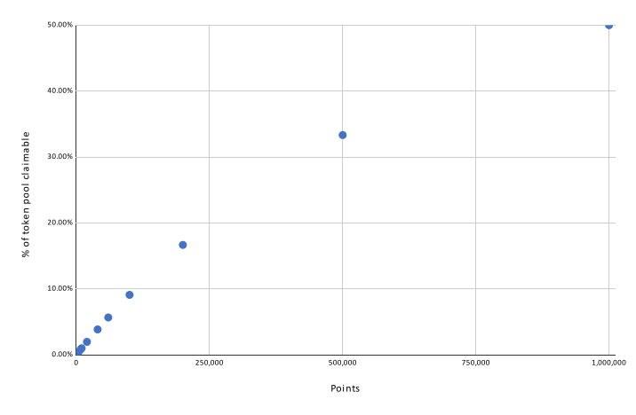

# Rewards

## Voting Rewards

At the end of each voting period, a number of points is awarded based on the number of AST used to vote. Points enable you to claim a certain percentage of the rewards pool based on the formula

$$
R = (B / (10^S +P )) * M/100
$$

where R is the rewards you can obtain, P is the number of points used to claim (multiplied by 10^4), B is the token balance in the rewards pool, S and M are community adjustable parameters (currently set to S = 10 and M = 100).

The formula results in rewards being paid out on a smooth curve based on the number of points used to claim.

⚠ Note that fees are continuously streaming into the community pool and participants are continuously claiming tokens. Due to the dynamic nature of this process, slippage on claims is possible.


You can [see the tokens in the pool](https://app.zerion.io/0x7296333e1615721f4Bd9Df1a3070537484A50CF8/overview) and [calculate potential rewards using this dashboard](https://dune.xyz/agrimony/airswap\_3)


## Circle Funding

Contributor circles are funded from two sources - a base level of funding paid out from the treasury, and a bonus funding pool derived from trade fees collected. The base fundings are paid out in AST while the bonus fundings are paid out in the currency of the consolidated token pool (currently WETH).

Circle funds will be then distributed based on individual contributions during each cycle.

| Circle      | Base (AST per contributor) | Bonus (in total)           |
| ----------- | -------------------------- | -------------------------- |
| Governance  | 2,750                      | 2% of trade fees collected |
| Ambassador  | 4,500                      | 4% of trade fees collected |
| Development | 9,000                      | 8% of trade fees collected |


The base funding amount does not guarantee a minimum to be earned by each contributor. Instead, base funds are summed up and split among contributors based on their allocations within Coordinape.


## Circle Allocation

After each 4 week cycle, [Coordinape ](https://coordinape.com)circles will open for all contributors to reward their co-workers with GIVE tokens. Contributors will start with 100 GIVE tokens. These GIVE tokens are used to reward team members with according to their impact in the circle during the current cycle.

After the allocation period is complete, any GIVE tokens not distributed will be burnt (there is no use holding GIVE tokens for yourself!). Individual contributors will be rewarded from the base/bonus circle funds proportionally to their GIVE allocations received.


The GIVE allocation system is open and transparent, so GIVE fairly and honestly!

