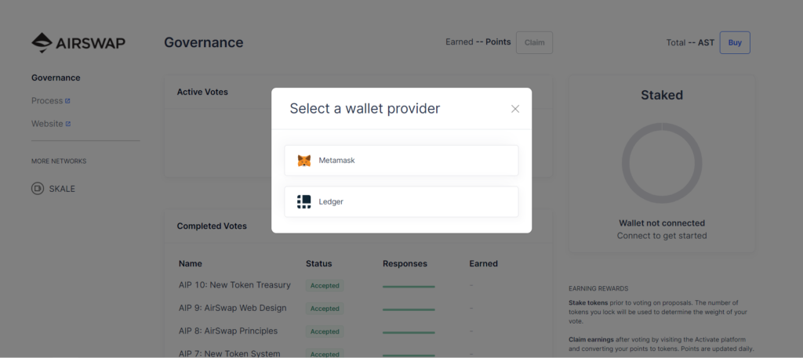
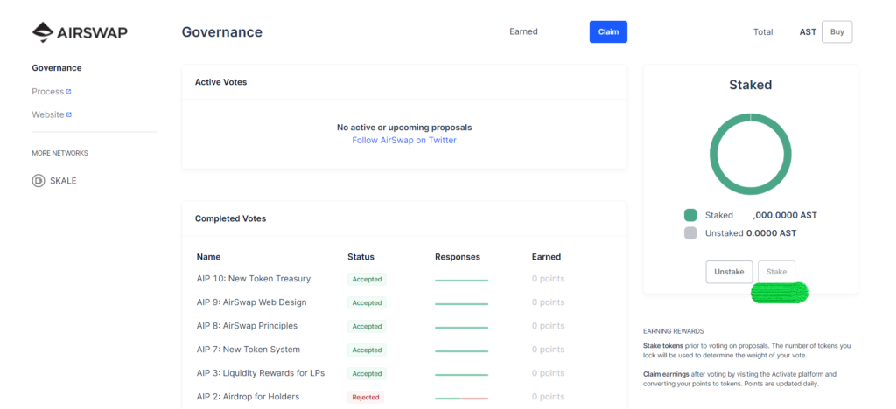

# Staking

## Staking on Activate

To participate in voting, your staked AST \(sAST\) balance will be used to determine the weight of your votes. AST is staked at a 1:1 rate and tokens are unstakeable **from 0% to 100% over the course of 20 weeks and locked for the first 4 weeks**.

Staking and unstaking is done through the Codefi Activate platform. Follow the user guides below to learn how to stake your tokens using [Metamask](https://metamask.io/).


Several older stakes were left on legacy staking contracts. For those on the [original ](https://etherscan.io/address/0xa4C5107184a88D4B324Dd10D98a11dd8037823Fe)staking contract, the maximum amount available to unstake is 10% every 7 days \(until &lt; 100 AST\). 

There is another [deprecated ](https://etherscan.io/address/0x704c5818b574358dfb5225563852639151a943ec)staking contract which follows the same unstaking protocol \(**unstakeable from 0% to 100% over the course of 20 weeks and locked for the first 4 weeks**\), however unstaking must be done by [manually interacting with the smart contract](manual-unstaking.md) rather than through Codefi Activate. 

If you aren't sure which staking contract you are on, drop us a question in the [Discord](https://chat.airswap.io)!


## Guides



### Connect your MetaMask wallet to the [Governance portal](https://activate.codefi.network/staking/airswap/governance)



### Click on Stake to begin the staking process.


Note there will be two transactions: one is for permission & the second one transfers your tokens to the staking contract.


### Staking complete

The dashboard should look like this one below.




## What do I do after staking?

Once you are staked, head over to Discord or Github to learn more about the latest proposals being discussed. Learn more in the next sections on voting and claiming.





