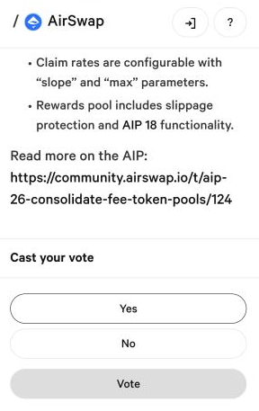

# Voting on Mobile

## Voting with MetaMask Mobile

* You will need to download and install MetaMask on your mobile \([https://play.google.com/store/apps/details?id=io.metamask&hl=en&gl=US](https://play.google.com/store/apps/details?id=io.metamask&hl=en&gl=US)\)
* Once your MetaMask mobile wallet is set up, click the voting page link and open it with MetaMask 

* Read through the AIP and make sure you understand what you are voting for 

* Select your choice to vote for

* A prompt to connect your wallet will open up. Select Metamask and confirm your choice.

* Sign the message to confirm your vote! \(signing does not require any gas fees\)

* Congratulations! Your vote has now been cast! Wait for the voting phase to complete to claim your points!

