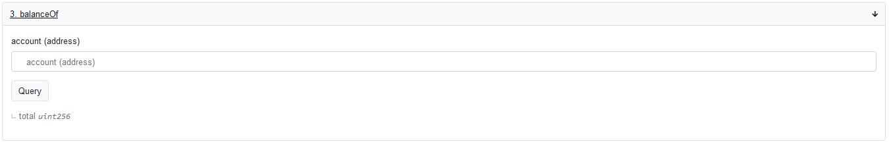
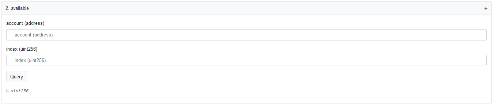
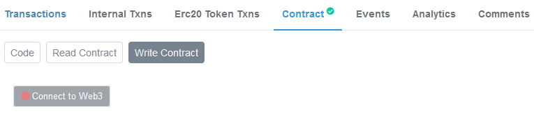
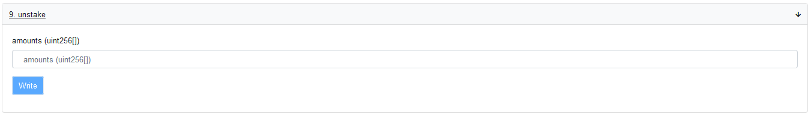

# Tutoriels

## Staking

### Connectez votre wallet MetaMask au [portail de gouvernance](https://activate.codefi.network/staking/airswap/governance)

### Cliquez sur Stake pour commencer le processus de staking


Notez qu'il y aura deux transactions : l'une pour l'autorisation et la seconde pour le transfert de vos tokens vers le contrat de staking.


### Staking terminé

Le tableau de bord devrait ressembler à celui ci-dessous.

## Voter avec MetaMask Mobile

* Vous devez télécharger et installer MetaMask sur votre téléphone portable \([https://play.google.com/store/apps/details?id=io.metamask&hl=en&gl=US](https://play.google.com/store/apps/details?id=io.metamask&hl=en&gl=US)\)
* Une fois que votre wallet mobile MetaMask est configuré, cliquez sur le lien de la page de vote et ouvrez-la avec MetaMask. 

* Lisez l'AIP et assurez-vous de bien comprendre ce pour quoi vous votez. 

* Sélectionnez votre choix pour voter pour

* Une invitation à connecter votre wallet s'ouvrira. Sélectionnez Metamask et confirmez votre choix.

* Signez le message pour confirmer votre vote ! \(la signature ne nécessite pas de frais de gaz\)

* Félicitations ! Votre vote a été enregistré ! Attendez que la phase de vote soit terminée pour réclamer vos points !

## Unstaking manuel d'un contrat déprécié

### Unstaking manuel

Naviguez jusqu'au contrat de staking déprécié sur [etherscan](https://etherscan.io/address/0x704c5818b574358dfb5225563852639151a943ec#readContract) -&gt; contract -&gt; read contract

### Vérifiez le solde AST dans le contrat

Sous `balanceOf`, Saisissez votre adresse et cliquez sur "Query" \("l'interrogation" de la chaîne ne nécessite pas de gaz\)

Vérifiez que le montant correspond au montant d'AST que vous avez staké.


Le montant affiché est multiplié par 10 000 pour tenir compte des décimales.


### Vérifier le solde disponible pour le unstake

Sous "disponible", entrez votre "adresse" et sous "index", entrez "0".

Ce nombre représente le montant d'AST disponible pour être unstaké actuellement. Assurez-vous que ce nombre corresponde au nombre d'AST dans `balanceOf` si vous voulez retirer le montant total.


Si vous avez effectué plusieurs stakes sur ce contrat, vous pouvez vérifier le solde disponible pour chaque mise en changeant `index`.


Si le nombre ne correspond pas non plus, vous devez attendre plus longtemps pour retirer la totalité du montant. \(20 semaines\), ou vous aviez misé sur plusieurs lots. Vérifiez l'historique de vos interactions avec ce contrat dans [etherscan ](https://etherscan.io/token/0x704c5818b574358dfb5225563852639151a943ec#balances)pour savoir quand vous avez staké, et combien de mises vous avez fait.

### Unstake

Enfin, pour unstaker, allez dans "Rédiger le contrat" et faites défiler jusqu'à la fonction "unstake".

Entrez le montant que vous souhaitez unstaker \(il doit être inférieur au solde `disponible` d'en haut\). Si vous avez staké plusieurs fois, vous pouvez unstaker en fournissant l'entrée dans un format de tableau. `[unstake1, unstake2, unstake3...]`.

Signez la transaction avec votre porte-monnaie web3 et payez les frais de gaz pour vous libérer !


N'oubliez pas de multiplier l'AST que vous souhaitez unstaker par 10 000 pour tenir compte des décimales.


