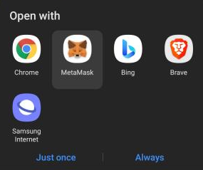
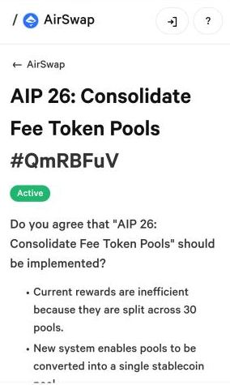
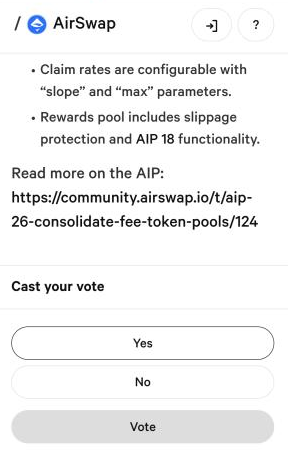
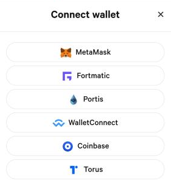
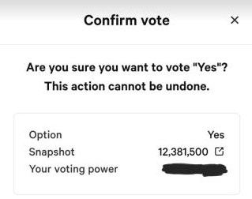
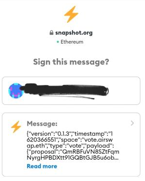

# Voters

To participate in voting, your staked AST \(sAST\) balance will be used to determine the weight of your votes. AST is staked at a 1:1 rate and tokens are unstakeable **from 0% to 100% over the course of 20 weeks and locked for the first 4 weeks**.

Reading up and informing yourself on each proposal is an important part of the process. Proposals can be browsed, reviewed, and contributed to in the [Proposal Discussions \(AIPs\)](https://github.com/airswap/airswap-aips/issues) category on GitHub. Voters can often find additional context on [Discord](https://chat.airswap.io/).

To browse and participate in votes, visit the [AirSwap governance portal](https://activate.codefi.network/staking/airswap/governance) on Codefi Activate. Note that voting is performed off-chain and does not cost gas \(ETH\). At the completion of each vote that you participate in, you’ll notice the Activate portal has updated your points balance.

Once points are updated, participants are able to claim rewards.

### Rewards

By participating in the decentralized governance process, you can earn points, which can be used to claim tokens from the community pool. The community pool is filled by fees assessed on AirSwap trades performed through MetaMask Swaps.

Notes on points:

- Participants must vote to earn points.
- Points can be accumulated and do not expire.
- Points you earn are based on the weight of your vote.

Points can be used to claim tokens from the community pool. Depending on the number of points you use the amount of tokens you can withdraw varies. Amount is based on a formula where “scale” determines the conversion of points to tokens up to a “max” amount.

**REWARD = \(POINTS** _**BALANCE / \(10\*\*SCALE + POINTS\)\)**_ **\(MAX / 100\)**

- Note that POINTS are multiplied by 104 to account for AST decimal places. BALANCE is the balance of the pool to be claimed from. The SCALE and MAX variables are able to be changed by community vote and are currently 10 and 100 respectively.
- Note that fees are continuously streaming into the community pool and participants are continuously claiming tokens. Due to the dynamic nature of this process, slippage on claims is possible.

You can [see the tokens in the pool](https://app.zerion.io/0x7296333e1615721f4Bd9Df1a3070537484A50CF8/overview) and [calculate potential rewards with this sheet](https://docs.google.com/spreadsheets/d/1VU65mQUF8sADMT__Mr0nEHdbSTidR-XgGwzicizCXko/edit#gid=0).

## Staking on Activate

AirSwap Recently introduced a staking feature for token holders. Now you can stake AST and earn rewards for participating in the decentralized governance process. Below I will show how you can easily stake your AST with MetaMask Wallet.

### First, go to the new AirSwap governance portal and connect your MetaMask wallet.

Link here: [https://activate.codefi.network/staking/airswap/governance](https://activate.codefi.network/staking/airswap/governance)

### Click on Stake to begin the staking process.

Note there will be two transactions: one is for permission & the second one transfers your tokens to the staking contract.

### Staking complete

The dashboard will look like this one below.

### Participating in votes to earn points

Once you've voted, you'll notice your points have increased.

### Using points to claim rewards

You can choose from your favorite tokens.

## Voting with MetaMask Mobile

1. You will need to download and install MetaMask on your mobile \([https://play.google.com/store/apps/details?id=io.metamask&hl=en&gl=US](https://play.google.com/store/apps/details?id=io.metamask&hl=en&gl=US)\)
2. Once your MetaMask mobile wallet is set up, click the voting page link and open it with MetaMask 
3. Read through the AIP and make sure you understand what you are voting for 
4. Select your choice to vote for 
5. It should prompt you to connect your wallet 
6. Cast your vote! 
7. You will have to sign a message to confirm the vote. \(This does not require you to pay any gas fees\) 
8. Congratulations on participation! You will receive your points after the vote is completed.
