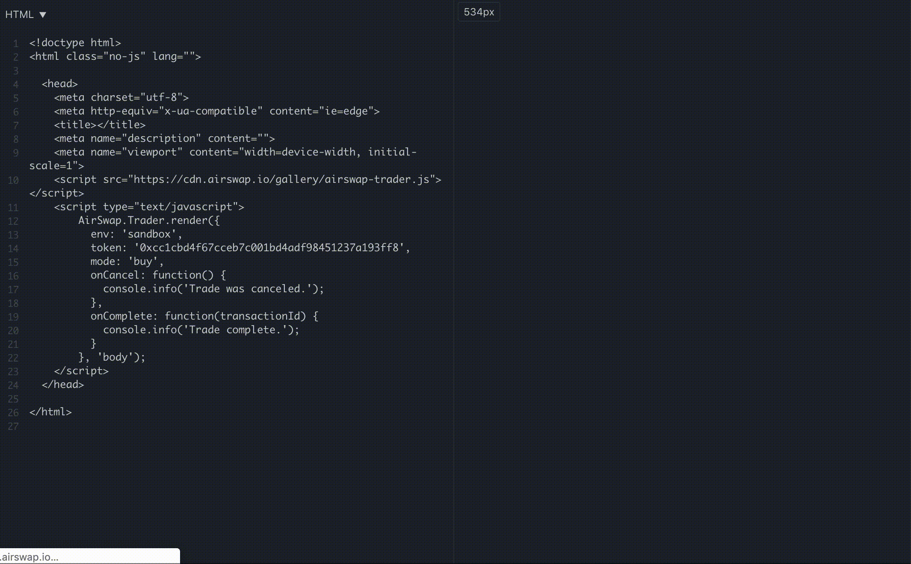

# Introduction


 We will no longer update AirSwap’s Legacy Widget, but we will continue to support it until our [new widget](./add-to-your-app.md) reaches full feature parity. 





The AirSwap Widget is an embeddable trading frontend that lets your users make ERC20 trades without leaving your application. The [`demo.html`](https://github.com/airswap/developers/blob/master/widget/demo.html) file shows usage of the Widget API on the **Rinkeby** sandbox. Keep in mind there may not be active peers using the sandbox at any given time. Join the AirSwap Developers Telegram group at https://t.me/airswapdevs or the AirSwap Community at https://t.me/airswap for conversation and support.

To try the demo, run the following:

```
python3 -m http.server
```

And navigate to http://localhost:8000/demo.html.

## Basic Example

```html
<head>
...
    <script src="https://cdn.airswap.io/gallery/airswap-trader.js"></script>
...
</head>
```

```js
AirSwap.Trader.render({
    onComplete: function(transactionId) {
        console.info('Trade complete. Thank you, come again.');
    }
}, 'body');
```

## Environments

By default your widget will connect to the AirSwap `sandbox` environment which loads the frontend located at https://sandbox.airswap.io/. To set your widget to make trades on mainnet, set the `env` parameter to `production`.

## With Options

```js
AirSwap.Trader.render({
    mode: 'buy',
    amount: '10000',
    token: '0x0...',
    onCancel: function () {
        console.info('Trade was canceled.');
    },
    onComplete: function(transactionId) {
        console.info('Trade complete. Thank you, come again.');
    }
}, 'body');
```

## JavaScript API

```js
AirSwap.Trader.render(options, parent);
```

The `options` argument is an object with parameters listed below. The `parent` argument is a DOM node that lives on the page, optimally the `body` element. Once the widget is closed the element is removed from the DOM.

## Add New Token

You can add an intent to trade any token to the indexer, as long as the token associated with an intent isn’t blacklisted.
The [AirSwap UI](https://www.airswap.io) is powered by [this metadata endpoint](https://token-metadata.airswap.io/tokens). Tokens will automatically be added to this metadata endpoint when they are posted to the indexer (on a half hour cron). The `airswapUI` flag on the token will be changed from `new` to `yes` after a check by us to make sure newly listed tokens aren’t blacklisted.

[Rinkeby tokens can be found here](https://token-metadata.airswap.io/rinkebyTokens). New Rinkeby tokens are added on request.

# Options

#### mode : `string` - `required`

Either `buy` or `sell`. This will restrict the mode to buy or sell.

#### token : `string` - `required`

A fixed `token` to `buy` in exchange for ETH (or `baseToken`) or `sell` in exchange for WETH (or `baseToken`).

#### baseToken : `string`

By default, the widget will search for trades in `'ETH'`. If you specify the string `'DAI'` for this parameter, the widget will search for `token`/`DAI` orders instead of `token`/`ETH` orders. **Note: you will likely need to run an order server until more peers on the network start making DAI orders. At the time of writing, most makers are only serving ETH orders**

#### amount : `string`

A default `amount` in the smallest unit e.g. Wei. Can be edited by the user.

#### address : `string`

A fixed `address` to query a specific counter-party for orders.

#### onCancel : `function` - `required`

A function called when the user has canceled or dismissed the widget. No arguments.

```js
function onCancel() { console.log('Canceled!'); }
```

#### onComplete : `function` - `required`

Called when the transaction sent to the blockchain has succeeded. The transaction ID is passed as an argument.

```js
function onComplete(transactionId) { console.log('Complete!', transactionId); }
```
