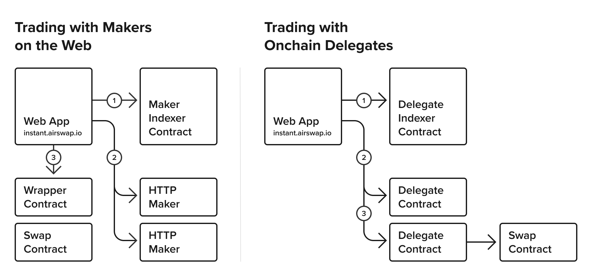

Under the hood, AirSwap Instant works with a combination of web protocols and smart contracts. There are two kinds of makers in the system, those that run their own HTTP servers to provide liquidity, and those that manage onchain delegates that make trades on their behalf.

# Trading with Makers on the Web

The **Web App** calls...

1. `getIntents` on the **Maker [Indexer](../contracts/indexer.md) Contract** and gets back HTTP endpoints.
2. `getOrder` on each **HTTP [Maker](running-makers.md)** using JSON-RPC over HTTP.
3. `swap` on the **[Swap](../contracts/swap.md) Contract** with the order that it wishes to trade.

# Trading with Onchain Delegates

The **Web App** calls...

1. `getIntents` on the **Delegate [Indexer](../contracts/indexer.md) Contract** and gets back contract addresses.
2. `get*Quote` on each **[Delegate](../delegate.md) Contract**.
3. `provideOrder` on the selected **Delegate Contract** that performs the **[Swap](../contracts/swap.md)**.
