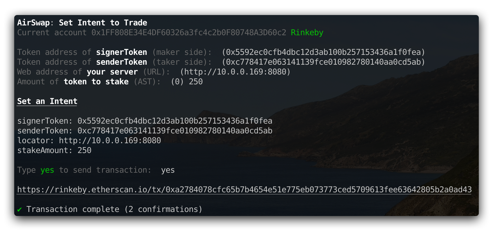

Makers are HTTP servers that implement the [Maker API](#maker-api) using [JSON-RPC 2.0](http://www.jsonrpc.org/specification). To be accessible by other applications and websites, the server must be run at a public URL with [CORS](https://developer.mozilla.org/en-US/docs/Web/HTTP/CORS) enabled. The URL then must be staked on an _indexer_ contract that takers query based on the tokens being traded. To get started, you can either use the Maker Kit or build your own maker.

# Use the Maker Kit

Maker Kit includes a reference implementation and set of tools to help you run a maker.



[Check it out on GitHub](https://github.com/airswap/airswap-maker-kit) to get started.

# Build Your Own

## Terminology

At the liquidity level, a **maker** is a trading party that is generally available to provide pricing and make trades. A **taker** is a trading party that trades one-off or periodically and accepts the pricing of makers. Makers are expected to implement the following methods taking the API role of **signer** in all cases. The following Maker API is implemented by makers via JSON-RPC over HTTP. At the API level, a **signer** is the party that creates and cryptographically signs an order, and a **sender** is the party that sends it to the blockchain for settlement.

## Maker API

### `getSenderSideQuote`

Given a `signerParam` and token pair, return a complete quote. The `senderParam` value is the amount the taker would send. The taker is **buying** from you.

**Example Request**

```json
{
  "jsonrpc": "2.0",
  "method": "getSenderSideQuote",
  "params": {
    "senderToken": "0xc778417e063141139fce010982780140aa0cd5ab",
    "signerToken": "0x27054b13b1b798b345b591a4d22e6562d47ea75a",
    "signerParam": "100000000"
  },
  "id": "123"
}
```

| Param         | Type      | Description                                 |
| :------------ | :-------- | :------------------------------------------ |
| `signerParam` | `uint256` | Amount of ERC-20 the signer would transfer. |
| `senderToken` | `address` | Token the sender would transfer.            |
| `signerToken` | `address` | Token the signer would transfer.            |

A successful `getSenderSideQuote` returns a [Quote](./orders-and-signatures.md#quotes-versus-orders) object including the requested `senderParam`.

### `getSignerSideQuote`

Given a `senderParam` and token pair, return a complete quote. The `signerParam` value is the amount you would send. The taker is **selling** to you.

**Example Request**

```json
{
  "jsonrpc": "2.0",
  "method": "getSignerSideQuote",
  "params": {
    "senderToken": "0xc778417e063141139fce010982780140aa0cd5ab",
    "senderParam": "100000000",
    "signerToken": "0x27054b13b1b798b345b591a4d22e6562d47ea75a"
  },
  "id": "123"
}
```

| Param         | Type      | Description                                 |
| :------------ | :-------- | :------------------------------------------ |
| `senderParam` | `uint256` | Amount of ERC-20 the sender would transfer. |
| `senderToken` | `address` | Token the sender would transfer.            |
| `signerToken` | `address` | Token the signer would transfer.            |

A successful `getSignerSideQuote` returns a [Quote](./orders-and-signatures.md#quotes-versus-orders) object including the requested `signerParam`. Maximum amounts of tokens you're willing to trade.

### `getMaxQuote`

Given a token pair, return a quote object with the maximum amounts you're willing to trade.

**Example Request**

```json
{
  "jsonrpc": "2.0",
  "method": "getMaxQuote",
  "params": {
    "senderToken": "0xc778417e063141139fce010982780140aa0cd5ab",
    "signerToken": "0x27054b13b1b798b345b591a4d22e6562d47ea75a"
  },
  "id": "123"
}
```

| Param         | Type      | Description                          |
| :------------ | :-------- | :----------------------------------- |
| `senderToken` | `address` | The token the sender would transfer. |
| `signerToken` | `address` | The token the signer would transfer. |

A successful `getMaxQuote` returns a [Quote](./orders-and-signatures.md#quotes-versus-orders) object.

### `getSenderSideOrder`

Given a `signerParam`, `senderWallet`, and token pair, return a complete order. The `senderParam` value is the amount the taker would send. The taker is **buying** from you.

**Example Request**

```json
{
  "jsonrpc": "2.0",
  "method": "getSenderSideOrder",
  "params": {
    "signerParam": "10000",
    "signerToken": "0x27054b13b1b798b345b591a4d22e6562d47ea75a",
    "senderToken": "0xc778417e063141139fce010982780140aa0cd5ab",
    "senderWallet": "0x1FF808E34E4DF60326a3fc4c2b0F80748A3D60c2",
    "signatureValidator": "0x43f18D371f388ABE40b9dDaac44D1C9c9185a078"
  },
  "id": "123"
}
```

| Param                | Type      | Description                                 |
| :------------------- | :-------- | :------------------------------------------ |
| `signerParam`        | `uint256` | Amount of ERC-20 the signer would transfer. |
| `signerToken`        | `address` | Token the signer would transfer.            |
| `senderToken`        | `address` | Token the sender would transfer.            |
| `senderWallet`       | `address` | Wallet of the sender.                       |
| `signatureValidator` | `address` | Swap contract the sender intends to use.    |

A successful `getSenderSideOrder` returns a signed [Order](./orders-and-signatures.md#creating-orders) object including the requested `senderParam`.

### `getSignerSideOrder`

Given a `senderParam`, `senderWallet`, and token pair, return a complete order. The `signerParam` value is the amount you would send. The taker is **selling** to you.

**Example Request**

```json
{
  "jsonrpc": "2.0",
  "method": "getSignerSideOrder",
  "params": {
    "signerToken": "0x27054b13b1b798b345b591a4d22e6562d47ea75a",
    "senderWallet": "0x1FF808E34E4DF60326a3fc4c2b0F80748A3D60c2",
    "senderToken": "0xc778417e063141139fce010982780140aa0cd5ab",
    "senderParam": "100000000",
    "signatureValidator": "0x43f18D371f388ABE40b9dDaac44D1C9c9185a078"
  },
  "id": "123"
}
```

| Param                | Type      | Description                                     |
| :------------------- | :-------- | :---------------------------------------------- |
| `senderParam`        | `uint256` | The amount of ERC-20 the sender would transfer. |
| `signerToken`        | `address` | The token the signer would transfer.            |
| `senderToken`        | `address` | The token the sender would transfer.            |
| `senderWallet`       | `address` | The wallet of the sender.                       |
| `signatureValidator` | `address` | Swap contract the sender intends to use.        |

A successful `getSignerSideOrder` returns a signed [Order](./orders-and-signatures.md#creating-orders) object including the requested `signerParam`.

## Error codes

The above call may have thrown an error, matched by `id`:

**Example**

```json
{
  "id": 1,
  "jsonrpc": "2.0",
  "error": {
    "code": -33605,
    "message": "Rate limit exceeded"
  }
}
```

The following are error codes in the [JSON-RPC specification](http://www.jsonrpc.org/specification#error_object):

- `-32700` Parse error
- `-32600` Invalid Request
- `-32601` Method not found
- `-32602` Invalid params
- `-32603` Internal error
- `-32000 to -32099` Reserved for implementation-defined server-errors.

We have allocated the following range for Swap Protocol errors:

- `-33600` Cannot provide the requested quote or order
- `-33601` Not trading the requested `signerToken` `senderToken` pair
- `-33602` The specified `senderParam` or `signerParam` is too low
- `-33603` The specified `senderParam` or `signerParam` is too high
- `-33604` Improperly formatted `signerToken`, `senderToken`, or `senderWallet` address
- `-33605` Rate limit exceeded
- `-33700 to -33799` Reserved for implementation specific trading errors.

## Indexer API

Indexers are smart contracts used to signal your intent to trade and publish the URL at which your maker is running. You can interact with indexer contracts either programmatically or through tools like [AirSwap Maker Kit](https://github.com/airswap/airswap-maker-kit) and [MEW](https://www.myetherwallet.com/). See the [Indexer Contract](../contracts/indexer.md) for complete method details.

### `createIndex`

Each token pair must have an `Index` before calling `setIntent`. If the requested `Index` already exists, the function returns its address.

```java
function createIndex(
  address signerToken,
  address senderToken
) external returns (address)
```

| Param         | Type      | Description                                                |
| :------------ | :-------- | :--------------------------------------------------------- |
| `signerToken` | `address` | Address of the token transferred from a signer in a trade. |
| `senderToken` | `address` | Address of the token transferred from a sender in a trade. |

### `setIntent`

Stake tokens to the indexer and set an intent to trade. If the caller already has an intent on the specified Index, then the intent is updated to reflect the new `stakingAmount` and `locator`.

```java
function setIntent(
  address signerToken,
  address senderToken,
  uint256 stakingAmount,
  bytes32 locator
) external
```

| Param           | Type      | Description                                             |
| :-------------- | :-------- | :------------------------------------------------------ |
| `signerToken`   | `address` | Signer token of the Index being staked.                 |
| `senderToken`   | `address` | Sender token of the Index being staked.                 |
| `stakingAmount` | `uint256` | Amount of stakingToken to stake.                        |
| `locator`       | `bytes32` | Arbitrary data. Often an address in the first 20 bytes. |

### `unsetIntent`

Unset an intent to trade and return staked tokens to the sender.

```java
function unsetIntent(
  address signerToken,
  address senderToken
) external
```

| Param         | Type      | Description                               |
| :------------ | :-------- | :---------------------------------------- |
| `signerToken` | `address` | Signer token of the Index being unstaked. |
| `senderToken` | `address` | Sender token of the Index being unstaked. |

### `getLocators`

Get a list of locators that have an intent to trade a token pair. Along with the locators, their corresponding staking scores are returned, and the address of the next cursor to pass back into the function to achieve pagination.

```java
function getLocators(
  address signerToken,
  address senderToken,
  address cursor,
  uint256 limit
) external view returns (
  bytes32[] memory locators,
  uint256[] memory scores,
  address nextCursor
) {
```

| Param         | Type      | Description                                     |
| :------------ | :-------- | :---------------------------------------------- |
| `signerToken` | `address` | Address of the token that the signer transfers. |
| `senderToken` | `address` | Address of the token that the sender transfers. |
| `cursor`      | `address` | Address of the user to start from in the list.  |
| `limit`       | `uint256` | Maximum number of items to return.              |

# Helpful for Testing

The following resources are helpful for testing on **Rinkeby**.

- **ETH** to pay for transactions - [Faucet](https://faucet.rinkeby.io/)
- **WETH** for trading - `0xc778417e063141139fce010982780140aa0cd5ab` [Etherscan](https://rinkeby.etherscan.io/address/0xc778417e063141139fce010982780140aa0cd5ab)
- **DAI** for trading - `0x5592ec0cfb4dbc12d3ab100b257153436a1f0fea` [Etherscan](https://rinkeby.etherscan.io/address/0x5592ec0cfb4dbc12d3ab100b257153436a1f0fea)
- **AST** for staking - `0xcc1cbd4f67cceb7c001bd4adf98451237a193ff8` [Etherscan](https://rinkeby.etherscan.io/address/0xcc1cbd4f67cceb7c001bd4adf98451237a193ff8) / [Faucet](https://ast-faucet-ui.development.airswap.io/)
