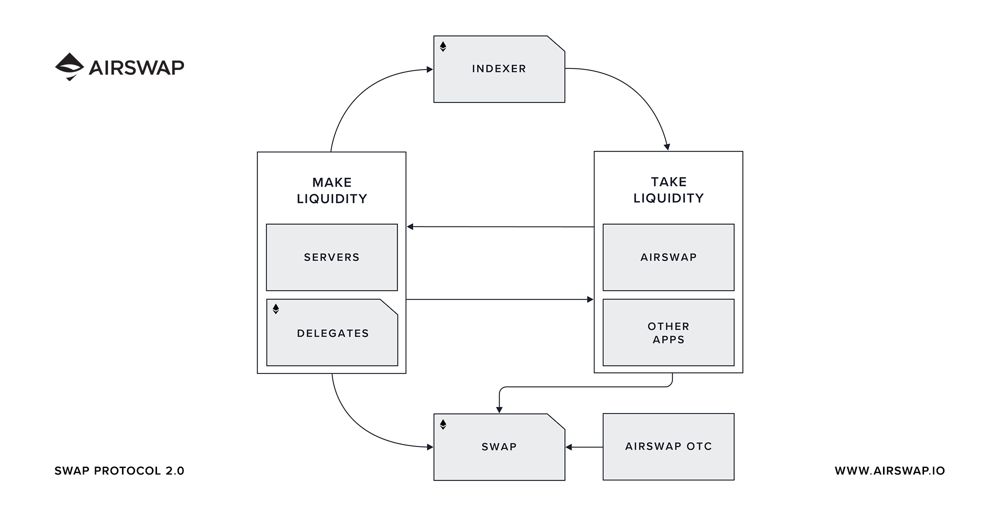

AirSwap works with a combination of web protocols and smart contracts. There are two kinds of liquidity providers in the system, those that run their own HTTP servers to provide liquidity, and those that manage onchain delegates that make trades on their behalf.

Each swap is between at least two parties, a `signer` and a `sender`. The `signer` is the party that creates and cryptographically signs an order, and `sender` is the party that sends the order to the Ethereum blockchain for settlement.

# Trading with Servers

Servers (HTTPS) implement the [Quote](../protocols/quote.md) and [Order](../protocols/order.md) protocols.

**Takers** call...

1. `getIntents` on the **Server [Indexer](../reference/indexer.md)** using protocol `0x0000` and receives locators (URLs).
2. `getOrder` on each **HTTPS [Server](../make-liquidity/run-a-server.md)** using JSON-RPC over HTTPS.
3. `swap` on the **[Swap](../reference/swap.md) Contract** with the order that it wishes to execute.

# Trading with Delegates

Delegates (On-chain) implement the [Quote](../protocols/quote.md) and [Last Look](../protocols/last-look.md) protocols.

**Takers** call...

1. `getIntents` on the **Delegate [Indexer](../reference/indexer.md)** using protocol `0x0001` and receives contract addresses.
2. `get*Quote` on each **[Delegate](../reference/delegate.md) Contract**.
3. `provideOrder` on the selected **Delegate Contract** that performs the **[Swap](../reference/swap.md)**.

# Third-Parties

**Authorizations** are for parties that trade on behalf of others. These parties are authorized by an individual to send or sign orders for them. Parties can be wallets (people or programs) or smart contracts.

**Affiliates** are third-parties compensated for their part in bringing together the two parties of a trade, and can be other traders or software applications that connect traders on the network.
