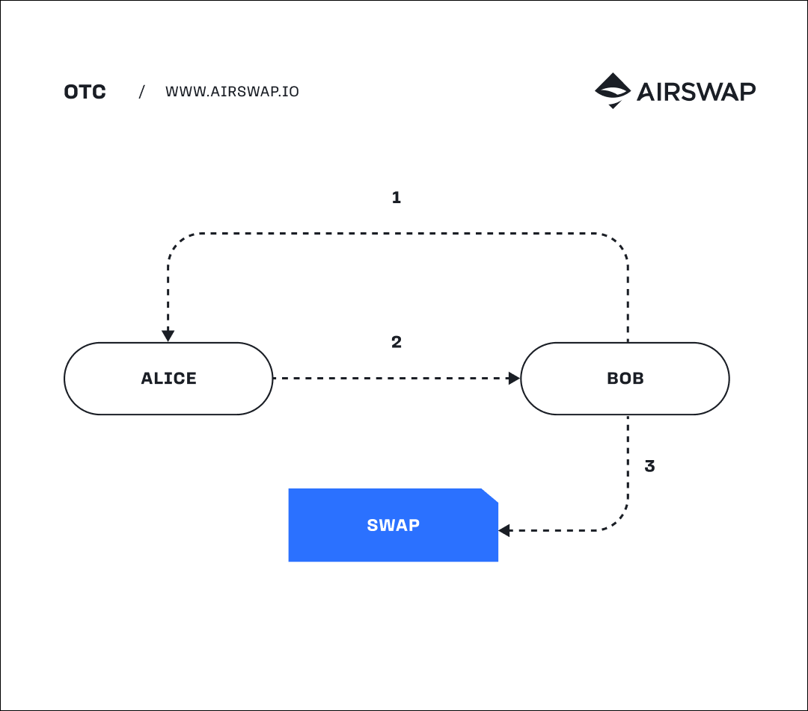
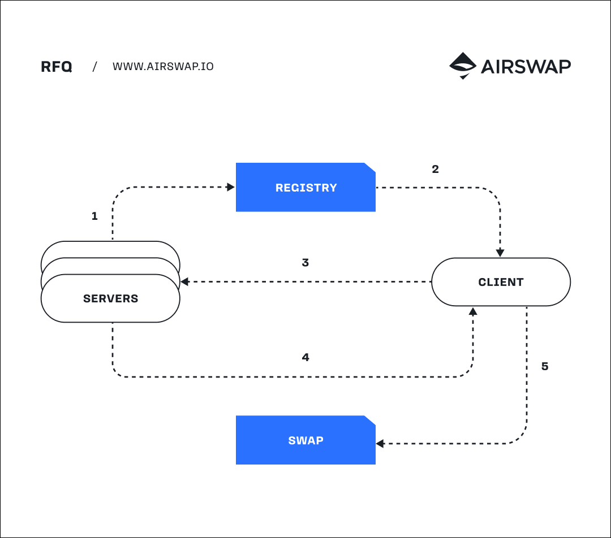
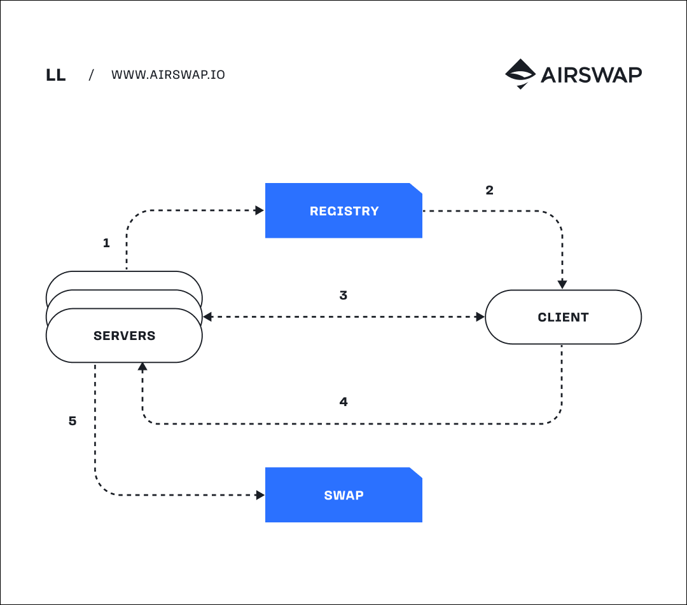

# Digital Tokens

**Digital tokens are ownable assets** implemented as [smart contracts](https://ethereum.org/en/smart-contracts/) with internal ledgers and standard interfaces to transfer balances among holders. Tokens are either fungible (each unit is interchangeable) or non-fungible (each unit is unique). Standards include ERC20, ERC777 for fungible and ERC721 and ERC1155 for non-fungible tokens (NFT).

Digital tokens can represent both purely digital assets and real-world assets.

# Decentralized Exchange

**Exchanges have evolved over millennia.** Many involve a centralized venue or entity to coordinate trades. [Limit order books](https://www.investopedia.com/terms/l/limitorderbook.asp), with a digital "book" of bids (buy orders) and asks (sell orders), run high-performance centralized matching engines. These engines are carefully managed and regulated to protect market participants.

**With pseudonymous public ledgers** like Bitcoin and Ethereum came international centralized exchanges without the same management and regulation standards, introducing risk into a system that intended to put power into the hands of participants rather than trusted intermediaries that can be mismanaged, hacked, or broken.

**Early decentralized exchanges failed** because they attempted to replicate the order book model, which is fundamentally centralized. What we’ve since found is that decentralized models that perform well are either peer-to-peer (e.g. [AirSwap](https://airswap.io/)) or peer-to-contract (e.g. [Uniswap](https://uniswap.org/)).

# Atomic Swaps

**In database systems** an atomic transaction is an indivisible and irreducible series of operations such that either all occur or none occur. This concept of atomicity translates to smart contracts programmed to perform multiple digital token transfers in a single transaction. This enables multiple assets held by multiple parties to change hands without the risk of any party not receiving his or her funds. Atomic swaps are the core of P2P systems like AirSwap.

# Makers and Takers

**Makers provide prices and "make" a market.** On order books, makers continuously create and cancel bids and asks around market price and profit from the "spread" between the two. On P2P systems, makers are generally online and available to offer prices to other participants.

**Takers accept prices and "take" a market.** On order books, takers execute market buys or sells against existing orders created by makers. On P2P systems, takers come online when they intend to make a trade and connect to available makers to fetch pricing data.

# Slippage and Front-running

**Slippage occurs when** a trade executes differently than the expected price. This is caused by other orders being executed ahead of the submitted order. [Slippage](https://www.investopedia.com/terms/s/slippage.asp) can be to either the detriment or benefit of a trader, depending on which direction it occurs. Slippage is commonplace in all continuous markets, that is, a market where the previous order impacts the price of the next. Slippage is avoidable in P2P systems, which are not continuous.

**Front-running occurs when** a third-party sees an order before it is executed and takes advantage of this information to submit an order of its own to be executed first. [Front-running](https://www.investopedia.com/terms/f/frontrunning.asp) is prohibited in traditional markets. In the land of pseudonymous public ledgers, front-running is commonplace and a fundamental part of on-chain continuous markets through the practice of [MEV](https://ethereum.org/en/developers/docs/mev/). Front-running can also be avoided in P2P systems because they are not continuous.

# Peer-to-Peer (P2P) Swaps

Peer-to-peer swaps are enabled by an "atomic" transaction, through which both sides succeed or the entire transaction reverts. These transactions are without intermediaries and "trustless" in a way that neither party needs to trust one another to complete the swap.

At the protocol level, there are **signers**, which cryptographically sign terms (an order), and **senders** which submit those terms for settlement on the atomic swap contract. Different market participants may take the role of signer or sender depending on the flavor of P2P.

[AirSwap](https://airswap.io/) is the original peer-to-peer swaps protocol.

_Strengths_

- Takers interface with and consume pricing data directly from makers.
- Makers run fully custom, high performance pricing strategies.
- Front-running and market manipulation are not possible.
- Low execution costs due to simplicity of swap logic.

_Limitations_

- Usually requires a maker to be online and available for pricing.
- Makers must program and operate their own pricing strategies.

# Over the Counter (OTC)

**Over-the-counter (OTC) is a form of P2P Swaps** among known counterparties who communicate prices to each other via e.g. chat apps or email and use an atomic swap for settlement. OTC has all the benefits of its underlying P2P Swap protocol.

_Protocol_

1. Bob asks Alice for a price.
2. Alice signs and gives Bob a priced order.
3. Bob sends the order to the Swap contract.

# Request for Quote (RFQ)

**Request-for-quote (RFQ) is a form of P2P Swaps** among clients and servers on the Internet. RFQ is an automated request-response protocol for market makers running web servers from which clients request orders via HTTP or WebSocket.

_Features_

- Servers are run by makers and clients by takers.
- Servers are signers and clients are senders.
- Clients have the option to accept an order.
- Clients are guaranteed the price until expiry.
- Clients pay for execution.

_Protocol_

1. Server sets URL on the Registry and adds supported tokens.
2. Client queries the Registry for URLs by token.
3. Client sends each Server a web request to swap two tokens.
4. Each Server responds with a signed order including price.
5. Client sends the best order to the Swap contract.

# LastLook (LL)

**LastLook (LL) is a form of P2P Swaps** among clients and servers on the Internet. LL is an automated streaming protocol that allows servers to stream pricing updates to clients via WebSocket, which in turn sign and transmit orders back to the server.

_Features_

- Servers are run by makers and clients by takers.
- Clients are signers and servers are senders.
- Clients stream real-time pricing from servers.
- Servers have the option to accept an order.
- Servers pay for execution.

_Protocol_

1. Server sets URL on the Registry and adds supported tokens.
2. Client queries the Registry for URLs by token.
3. Client connects to each server and subscribes to the pricing stream.
4. Client signs and transmits an order to the server using server pricing.
5. Server sends the order to the Swap contract.

# Peer-to-Contract (P2C) Swaps

Peer-to-contract swaps are enabled by "automated market makers" (AMM), which determine price at time of execution based on a constant product formula. These transactions are without intermediaries and involve one party depositing "liquidity" and another party later taking it.

Makers in this case are "liquidity providers" who may make adjustments to their positions by depositing to and configuring the AMM. Takers simply execute a swap transaction on the AMM contract frontend often through an easy to use web app.

[Uniswap](https://uniswap.org/) is the original peer-to-contract swaps protocol.

_Strengths_

- Depositing and swapping against the AMM are easy.
- Does not require makers to be online and available for pricing.

_Limitations_

- Makers have limited ability to customize pricing strategies.
- Front-running and market manipulation are possible.
- Higher execution costs due to heavier swap logic.
