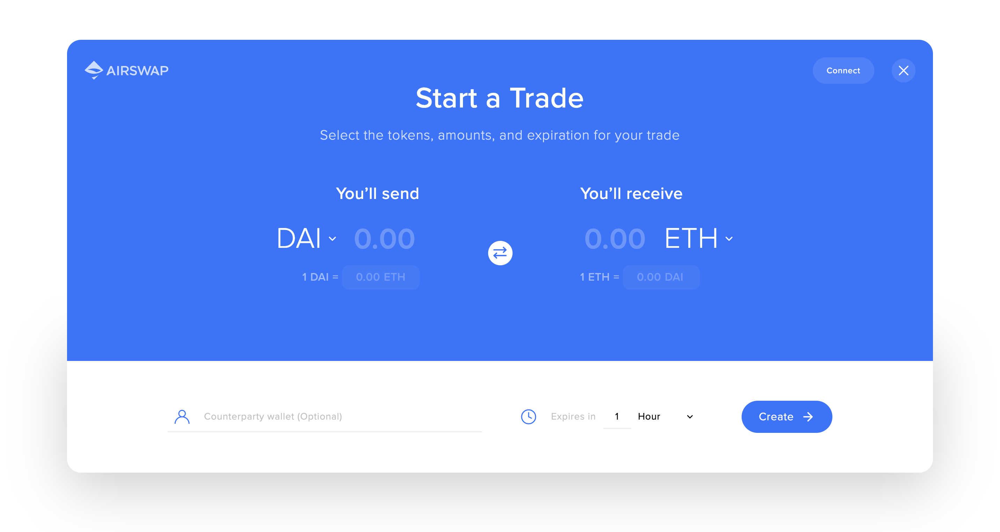
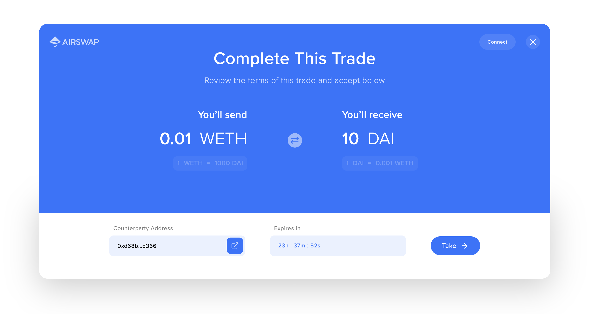

# Add Trader to Your App

[AirSwap Trader](https://trader.airswap.io/) can be added to any webpage for over-the-counter trading with no counterparty risk, no deposits, and no fees.



Check out the [CodePen](https://codepen.io/syjk129/pen/PoYpgmW) to explore configuration options.


## Setup

Add the following `script` tag to the `head` element in your web application.

```html
<script src="https://cdn.airswap.io/airswap-trader.js"></script>
```


Pop-up blockers can prevent the widget from loading properly.


## Display an new order builder

Embedding the widget is simple. Simply add the following code to where you want to open the widget. The optional `onCreate` callback function will be triggered once the user successfully creates an order. The order details and cid \(ipfs hash\) are passed as arguments.

```javascript
window.AirSwapTrader.render(
  {
    onCreate: (order, cid) => {
      console.log('Order created!')
    },
    onClose: transactionHash => {
      console.log('Widget closed')
    },
  },
  'body',
)
```



## Pre-fill values in the order builder

In many cases, you would want to set a desired token and amount. To do so, you can add an Order object to the widget options. Passing a value in the object will lock the corresponding field in the widget, preventing the user from changing the value.

```javascript
window.AirSwapTrader.render(
  {
    order: {
      expiry: 1707026510, // Expiration date in seconds
      maker: {
        token: '0x89d24a6b4ccb1b6faa2625fe562bdd9a23260359', // DAI
        param: '10000000000000000000', // Atomic value for 10 DAI
      },
      taker: {
        token: '0xc02aaa39b223fe8d0a0e5c4f27ead9083c756cc2', // WETH
        param: '10000000000000000', // Atomic value for 0.01 WETH
      },
    },
    onCreate: (order, cid) => {
      console.log('Order created!')
    },
    onClose: transactionHash => {
      console.log('Widget closed')
    },
  },
  'body',
)
```


## Display an existing signed order

To initiate the Taker flow you would need to pass the full order object. The `onSwap` callback function will be triggered when the taker fills the order and passes the hash of the transaction as an argument.

```javascript
window.AirSwapTrader.render(
  {
    order: {
      expiry: 1707026510,
      nonce: 1567014475983
      maker: {
        wallet: '0xd68bb3350887ed3ee128b5ac4b7d852e24c5d366',
        token: '0x89d24a6b4ccb1b6faa2625fe562bdd9a23260359',
        param: '1000000000000000000',
        kind: '0x36372b07'
      },
      taker: {
        wallet: '0x0000000000000000000000000000000000000000',
        token: '0xc02aaa39b223fe8d0a0e5c4f27ead9083c756cc2',
        param: '10000000000000000',
        kind: '0x36372b07'
      },
      affiliate: {
        wallet: '0x0000000000000000000000000000000000000000',
        token: '0x0000000000000000000000000000000000000000',
        param: '0',
        kind: '0x36372b07'
      },
      signature: {
        version: '0x01',
        signer: '0xd68bb3350887ed3ee128b5ac4b7d852e24c5d366',
        r: '0xf28352ca1252b77771d55293f0fd49f97e544ccdf34c88a4821502495aa5dfa8',
        s: '0x42e653d2a8b09adc6a547ae581a09162cb82d0e456d45fae662956b68de1a394',
        v: 28,
      },
    },
    onSwap: (transactionHash) => {
      console.log('Trade complete!')
    },
    onClose: (transactionHash) => {
      console.log('Widget closed')
    },
  },
  'body',
)
```

If you have the full signed order details stored in [IPFS](https://ipfs.io), you can use the IPFS hash instead.

```javascript
window.AirSwapTrader.render(
  {
    cid: 'QmRi5hnoBJPKJ54FnyqyRnzsigpEYLq75pyjuNeMjoEsNf',
    onSwap: transactionHash => {
      console.log('Trade complete!')
    },
    onClose: transactionHash => {
      console.log('Widget closed')
    },
  },
  'body',
)
```



## Options

| Key        | Type                                         | Field          | Description                                                                                                                                                                                         |
| :--------- | :------------------------------------------- | :------------- | :-------------------------------------------------------------------------------------------------------------------------------------------------------------------------------------------------- |
| `env`      | string                                       | `optional`     | Defaults to `production`. Using `production` connects to mainnet and `development` connects to the Rinkeby testnet.                                                                                 |
| `order`    | [Order](../contracts/swap-contract.md#order) | `optional`     | Optionally provide values to pre-populate the order builder. If any parameters are specified, it will lock that value in the builder. If a full order is provided, it will be presented for taking. |
| `cid`      | string                                       | `optional`     | [IPFS](https://ipfs.io) hash for the order. If provided, the widget will fetch the order details from IPFS and display a take order screen.                                                         |
| `onCreate` | Function                                     | `optional`     | [Callback function](add-to-your-app.md#onCreate) triggered on creation of a trade.                                                                                                                  |
| `onSubmit` | Function                                     | `optional`     | [Callback function](add-to-your-app.md#onSubmit) triggered on submission of a trade.                                                                                                                |
| `onSwap`   | Function                                     | `optional`     | [Callback function](add-to-your-app.md#onSwap) triggered on a successful trade.                                                                                                                     |
| `onCancel` | Function                                     | `optional`     | [Callback function](add-to-your-app.md#onCancel) triggered on a successful cancel.                                                                                                                  |
| `onError`  | Function                                     | `optional`     | [Callback function](add-to-your-app.md#onError) triggered when an error occurs on a trade submission.                                                                                               |
| `onClose`  | Function                                     | **`required`** | [Callback function](add-to-your-app.md#onClose) triggered on widget close.                                                                                                                          |

## Callbacks

### onCreate

Callback function triggered on creation of a trade. Passes the order and cid to the function as arguments.

```javascript
function onCreate(order, cid) {
    console.log('Order Created!');
    ...
}
```

| Type    | Parameter                         | Description                 |
| :------ | :-------------------------------- | :-------------------------- |
| `order` | [Order](add-to-your-app.md#order) | The order details.          |
| `cid`   | string                            | The IPFS Hash of the order. |

### onSubmit

Callback function triggered on submission of a trade. This does not necessarily mean that the trade was completed. No arguments.

```javascript
function onSubmit() {
    console.log('Order submitted!');
    ...
}
```

### onSwap

Callback function triggered on a successful trade. Passes the transaction hash of the fill event as an argument.

```javascript
function onSwap(transactionHash) {
    console.log('Trade Completed!');
    ...
}
```

| Type              | Parameter | Description                                                                                                                            |
| :---------------- | :-------- | :------------------------------------------------------------------------------------------------------------------------------------- |
| `transactionHash` | `string`  | Hash of the swap transaction. Can be used on blockchain explorers like [Etherscan](https://etherscan.io/) to view transaction details. |

### onError

Callback function triggered when an error occurs on a trade submission. The user can resolve the issue and try completing the trade again. Passes the error message as an argument.

```javascript
function onError(error) {
    console.log('There was an error on trade submission');
    console.log(error);
    ...
}
```

| Type    | Parameter | Description                            |
| :------ | :-------- | :------------------------------------- |
| `error` | `string`  | Description of the error that occured. |

### onCancel

Callback function triggered when a trade is canceled. Passes the transaction hash of the cancellation event as an argument.

```javascript
function onCancel(transactionHash) {
    console.log('Trade Cancelled!');
    ...
}
```

| Type              | Parameter | Description                                                                                                                                   |
| :---------------- | :-------- | :-------------------------------------------------------------------------------------------------------------------------------------------- |
| `transactionHash` | `string`  | Hash of the cancelation transaction. Can be used on blockchain explorers like [Etherscan](https://etherscan.io/) to view transaction details. |

### onClose

Callback function triggered when the user closes the widget. No arguments.

```javascript
function onClose() {
  console.log('Widget closed')
}
```
