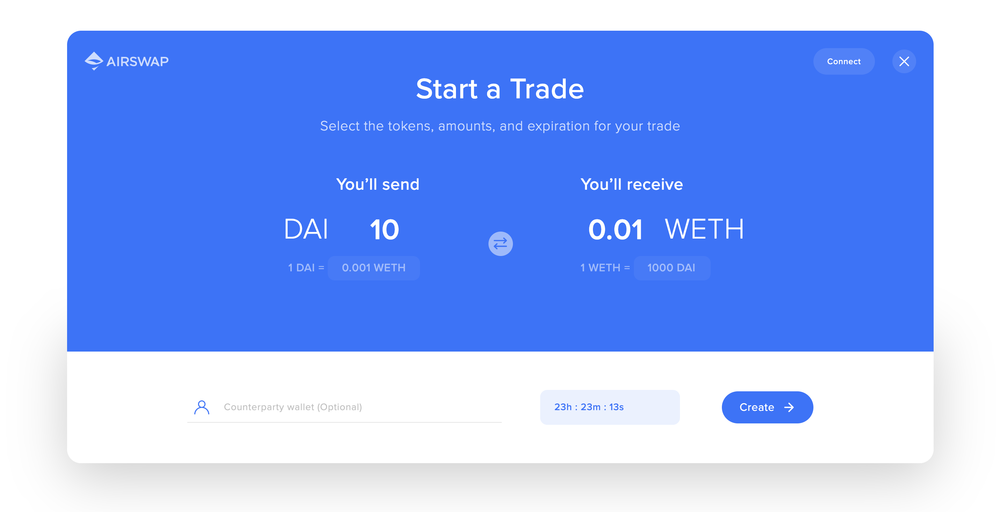

<script src="https://cdn.airswap.io/airswap-trader.js"></script>

[AirSwap Trader](https://trader.airswap.io/) is both a standalone app and an embeddable, HTML+JavaScript widget that can be added to any webpage to build and settle over-the-counter trades with no counterparty risk, no deposits, and no fees.


 Check out the [CodePen](https://codepen.io/syjk129/pen/PoYpgmW) to explore configuration options. 

# Setup

Add the following `script` tag to the `head` element in your web application.

```html
<script src="https://cdn.airswap.io/airswap-trader.js"></script>
```

 Pop-up blockers can prevent the widget from loading properly. 

# Display an new order builder

Embedding the widget is very simple. Simply add the following code to where you want to open the widget. The optional `onCreate` callback function will be triggered once the user successfully creates an order. The [order details](#order) and [cid](#cid) (ipfs hash) are passed as arguments.

```js
window.AirSwapTrader.render(
  {
    onCreate: (order, cid) => {
      console.log('Order created!')
    },
    onClose: transactionHash => {
      console.log('Widget closed')
    },
  },
  'body'
)
```


# Pre-fill values in the order builder

In many cases, you would want to set a desired token and amount. To do so, you can add an [Order object](#order) to the widget options. Passing a value in the object will lock the corresponding field in the widget, preventing the user from changing the value.

```js
window.AirSwapTrader.render(
  {
    order: {
      expiry: 1707026510, // Expiration date in seconds
      maker: {
        token: '0x89d24a6b4ccb1b6faa2625fe562bdd9a23260359', // DAI
        param: '10000000000000000000', // Atomic value for 10 DAI
      },
      taker: {
        token: '0xc02aaa39b223fe8d0a0e5c4f27ead9083c756cc2', // WETH
        param: '10000000000000000', // Atomic value for 0.01 WETH
      },
    },
    onCreate: (order, cid) => {
      console.log('Order created!')
    },
    onClose: transactionHash => {
      console.log('Widget closed')
    },
  },
  'body'
)
```



# Display an existing signed order

To initiate the Taker flow you would need to pass the full order object. The `onSwap` callback function will be triggered when the taker fills the order and passes the hash of the transaction as an argument.

```js
window.AirSwapTrader.render(
  {
    order: {
      expiry: 1707026510,
      nonce: 1567014475983
      maker: {
        wallet: '0xd68bb3350887ed3ee128b5ac4b7d852e24c5d366',
        token: '0x89d24a6b4ccb1b6faa2625fe562bdd9a23260359',
        param: '1000000000000000000',
        kind: '0x277f8169'
      },
      taker: {
        wallet: '0x0000000000000000000000000000000000000000',
        token: '0xc02aaa39b223fe8d0a0e5c4f27ead9083c756cc2',
        param: '10000000000000000',
        kind: '0x277f8169'
      },
      signature: {
        version: '0x01',
        signer: '0xd68bb3350887ed3ee128b5ac4b7d852e24c5d366',
        r: '0xf28352ca1252b77771d55293f0fd49f97e544ccdf34c88a4821502495aa5dfa8',
        s: '0x42e653d2a8b09adc6a547ae581a09162cb82d0e456d45fae662956b68de1a394',
        v: 28,
      },
    },
    onSwap: (transactionHash) => {
      console.log('Trade complete!')
    },
    onClose: (transactionHash) => {
      console.log('Widget closed')
    },
  },
  'body',
)
```

If you have the full signed order details stored in [IPFS](https://ipfs.io), you can use the IPFS hash instead.

```js
window.AirSwapTrader.render(
  {
    cid: 'QmRi5hnoBJPKJ54FnyqyRnzsigpEYLq75pyjuNeMjoEsNf',
    onSwap: transactionHash => {
      console.log('Trade complete!')
    },
    onClose: transactionHash => {
      console.log('Widget closed')
    },
  },
  'body'
)
```


# Options

| Key        | Type            | Field          | Description                                                                                                                                          |
| ---------- | --------------- | -------------- | ---------------------------------------------------------------------------------------------------------------------------------------------------- |
| `order`    | [Order](#order) | `optional`     | The Order details. Provide values to pre-populate the order builder. If any of these parameters are specified, it will lock the value in the widget. |
| `cid`      | string          | `optional`     | [IPFS](https://ipfs.io) hash for the order. If provided, the widget will fetch the order details from IPFS and display a take order screen.          |
| `onCreate` | Function        | `optional`     | [Callback function](#onCreate) triggered on creation of a trade.                                                                                     |
| `onSwap`   | Function        | `optional`     | [Callback function](#onSwap) triggered on a successful trade.                                                                                        |
| `onCancel` | Function        | `optional`     | [Callback function](#onCancel) triggered on a successful cancel.                                                                                     |
| `onClose`  | Function        | **`required`** | [Callback function](#onClose) triggered on widget close.                                                                                             |

---

## Order

Provide values to pre-populate the order builder. If any of these parameters are specified, it will lock the value in the widget. When setting a signed order, all values must be set.

```js
order: {
  expiry: 1567024230,
  nonce: 1566932032583,
  maker: {
    ...
  },
  taker: {
    ...
  },
  signature: {
    ...
  }
}
```

| Type        | Key                     | Field      | Description                                                                                              |
| ----------- | ----------------------- | ---------- | -------------------------------------------------------------------------------------------------------- |
| `nonce`     | string                  | `optional` | A numeric parameter of every Order that is unique to its Maker. Only used when providing a signed order. |
| `expiry`    | string                  | `optional` | The expiry in **seconds** since unix epoch.                                                              |
| `maker`     | [Party](#party)         | `optional` | The Maker of the Order who sets price.                                                                   |
| `taker`     | [Party](#party)         | `optional` | The Taker of the Order who accepts price.                                                                |
| `signature` | [Signature](#signature) | `optional` | The signature of the order.                                                                              |

---

## Party

The details of a party.

```js
{
  wallet: '0xd68bb3350887ed3ee128b5ac4b7d852e24c5d366',
  token: '0x89d24a6b4ccb1b6faa2625fe562bdd9a23260359',
  param: '1000000000000000000',
  kind: '0x277f8169'
}
```

| Type     | Key    | Field      | Description                                               |
| -------- | ------ | ---------- | --------------------------------------------------------- |
| `wallet` | string | `optional` | The Ethereum account of the party                         |
| `token`  | string | `optional` | The address of the token the party sends or receives      |
| `param`  | string | `optional` | The amount of ERC-20 or the identifier of an ERC-721      |
| `kind`   | string | `optional` | The interface ID of the token. E.g. ERC-721 is 0x80ac58cd |

---

## Signature

The [ECDSA](https://hackernoon.com/a-closer-look-at-ethereum-signatures-5784c14abecc) signature of the order.

```js
{
  version: '0x01',
  signer: '0x1ffb1788e56a755a74d3b63a787b09b65ca35e12',
  r: '0xec5aac45d8d9fb9f1b32206db8ca5745bef0ff6cca4e10f96891712932674144',
  s: '0x74b363b16641a9cf51c8cad2e3b26bfcaec825b32122aeb41dce3db24ad90ec4',
  v: 28,
}
```

| Type      | Key    | Field      | Description                                 |
| --------- | ------ | ---------- | ------------------------------------------- |
| `version` | string | `required` | The signing method used.                    |
| `signer`  | string | `required` | The address of the signer Ethereum account. |
| `r`       | string | `required` | The `r` value of an ECDSA signature.        |
| `s`       | string | `required` | The `s` value of an ECDSA signature.        |
| `v`       | number | `required` | The `v` value of an ECDSA signature.        |

---

## cid

[IPFS](https://ipfs.io) hash for the order. If provided, the widget will fetch the order details from IPFS and display a take order screen.

---

## onCreate

Callback function triggered on creation of a trade. Passes the order and cid to the function as arguments.

```js
function onCreate(order, cid) {
    console.log('Order Created!');
    ...
}
```

| Type    | Parameter       | Description                 |
| ------- | --------------- | --------------------------- |
| `order` | [Order](#order) | The order details.          |
| `cid`   | string          | The IPFS Hash of the order. |

---

## onSwap

Callback function triggered on a successful trade. Passes the transaction hash of the fill event as an argument.

```js
function onSwap(transactionHash) {
    console.log('Trade Completed!');
    ...
}
```

| Type              | Parameter | Description                                                                                                                            |
| ----------------- | --------- | -------------------------------------------------------------------------------------------------------------------------------------- |
| `transactionHash` | `string`  | Hash of the swap transaction. Can be used on blockchain explorers like [Etherscan](https://etherscan.io/) to view transaction details. |

---

## onCancel

Callback function triggered when a trade is canceled. Passes the transaction hash of the cancellation event as an argument.

```js
function onCancel(transactionHash) {
    console.log('Trade Cancelled!');
    ...
}
```

| Type              | Parameter | Description                                                                                                                                   |
| ----------------- | --------- | --------------------------------------------------------------------------------------------------------------------------------------------- |
| `transactionHash` | `string`  | Hash of the cancelation transaction. Can be used on blockchain explorers like [Etherscan](https://etherscan.io/) to view transaction details. |

---

## onClose

Callback function triggered when the user closes the widget. No arguments.

```js
function onClose() {
  console.log('Widget closed')
}
```
